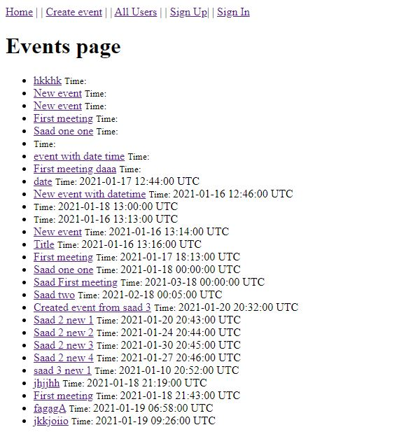

## 👩🏼‍💻 About

In this project, we created an event site using Rails Associations. Users can create events and attend events. 

## 🔧 Built With

- Ruby (language)
- Rails (framework)
- Devise (gem)

## 🤖 Getting started

You'll need to have both Ruby and Rails installed on your computer.

- In the desired directory, type `git clone https://github.com/abmAsadullah/private-events.git` in the terminal.

- Then type `cd private-events` in the terminal to change the directory into the root of the project.

- Then type `bundle install && yarn install` to download the necessary gem files for the project.

- Run `rails server` to start the server for the application.

- Open `localhost:3000` to start.

- Create an account and create event.

## Author

👤 **A B M Asadullah**

- GitHub: [@abmAsadullah](https://github.com/abmAsadullah)
- Twitter: [@abmAsadullah](https://twitter.com/abmAsadullah)
- LinkedIn: [abmAsadullah](https://www.linkedin.com/in/abmAsadullah)

## 🤝 Contributing

Contributions, issues, and feature requests are welcome!

## ⭐ Show your support

Give a ⭐️ if you like this project!

## 📝 License

This project is [MIT](https://opensource.org/licenses/MIT) licensed.
